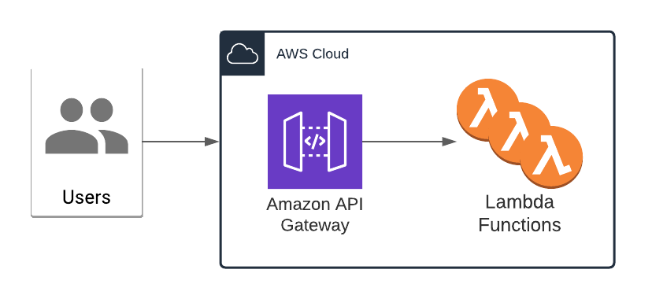

# Serverless Typescript Expressjs Starter



A typescript starter for Serverless APIs. Including testing frameworks and function routing bootstrapping.

## Core Tech

- Typescript
- Serverless
- Express
- eslint (airbnb rules)
- Jest (with supertest)

## Usage

### Running Locally

To run locally simply run `npx sls offline start`. The application will run by default on port 8000 (but you can change this with a `PORT` environment variable).

### Deploying

Simply run `npx sls deploy` with your aws credentials set.

_Note_: In current form, after deployment, your API is public and can be invoked by anyone. For production deployments, you might want to configure an authorizer. For details on how to do that, refer to [http event docs](https://www.serverless.com/framework/docs/providers/aws/events/apigateway/).

### Invocation

When running locally or deploying you can then call the API

Calling the `/example` path with either:

```bash
curl localhost:8000/example
curl https://xxxxxxx.execute-api.eu-west-1.amazonaws.com/dev/example
```

Should result in the following response:

```bash
{"message":"This is an example response"}
```
